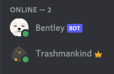

# Bentley  

> A discord bot built special for Bravo LT

Welcome to the Bentley readme! Bentley was made for [Bravo LT](https://www.bravolt.com/)'s Discord server, to assist with automation tasks and for fun. Click the badge below to install to your server:

### How it's made

- The whole thing is made with Typescript & Node
- It uses [Discord.js](https://discord.js.org/#/) to interact with the bot api
- Testing is done with Jest & ts-jest
- tsconfig.json handles the compiler settings to output js to a build folder
- Bentley is currently being hosted on [Heroku](https://www.heroku.com/) via a free worker to stay awake

### How to run

1. Clone/Fork the repo
2. Create an .env file based on the .env.example, using your own Discord bot api (more on that later)
3. `cd` into the repo directory, and run `npm run start` to host locally
4. Invite your bot to your Discord server
5. Check if it's online, and start running commands!
   

### Commands

Bentley supports several different commands, prefixed by `!` like `!greet`
When Bentley is online in your server, try `!help` to see all of the commands, and their descriptions.

### Credit

- Thanks to Bravo LT for having a [memoji page](https://www.bravolt.com/about-us) so I could grab a Bentley icon based on the very real dog
- Thanks to [MidasXIV](https://github.com/MidasXIV) for providing an excellent base for Discord.js interaction. Nobody wants to reinvent the wheel
